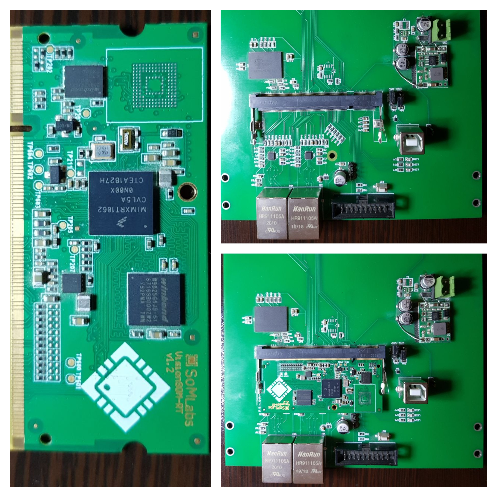

# 61850

It was an attempt to build a prototype of an IEC61850 communication board.
This project use an NXP I.MX RT 1062 microcontroller.
This microcontroller was selected because it has two MACs.
Using these two MACs, I implemented an LwIP netif driver which supports PRP(parallel redundancy protocol) protocol.
Using same mechanism, it is easy to implement HSR protocol. But, implementing RSTP could be a little different.

## Subprojects

This project is splitted to three repositories:
- Altium PCB project could be found [here](https://github.com/alisoam/61850-pcb)
- Bootloader program could be found [here](https://github.com/alisoam/61850-bootloader). Bootloader does nothing except running the main application in 0x61000000.
- Application program could be found [here](https://github.com/alisoam/61850-app). Application is the main program.

## PCB
The pcb mainly consist of a [SOMLab module]() and two SMSC lan8720 phy.

You can achive same two port ethernet setup with a [Teensy 4.1](https://www.pjrc.com/store/teensy41.html) board. It may need a little tweaking for the second ethernet port.

## Application Program
Application program uses [libiec61850](https://github.com/mz-automation/libiec61850).
It has two important parts:
- An implementation of an LwIP netif driver which support prp protocol.
- An implementation of libiec61850 hardware abstraction layer (HAL) to run on FreeRTOS() and LwIP.

With these two parts, it was possible to run the libiec61850 examples on FreeRTOS and LwIP with PRP(or other redundancy protocols) support.

## Other Approaches for PRP/HSR
In order to use the implemented LwIP netif driver your device should have two ethernet ports.
To have a device with two ports you can:
- Find a microcontroller with two MAC peripheral (Thats why i used the NXP I.MX 106x microcontroller series).
- Use a three port switch IC. Some switch allow the host port to select the desination output port for each packet. You can find suitable switche ics from Microchip web site. The switch ic may implement RSTP (or event HSR/PRP) itself.
- Other ways to have two ethernet ports on a single microcontroller :))).

with a little changes you can reuse the driver for other approaches.
